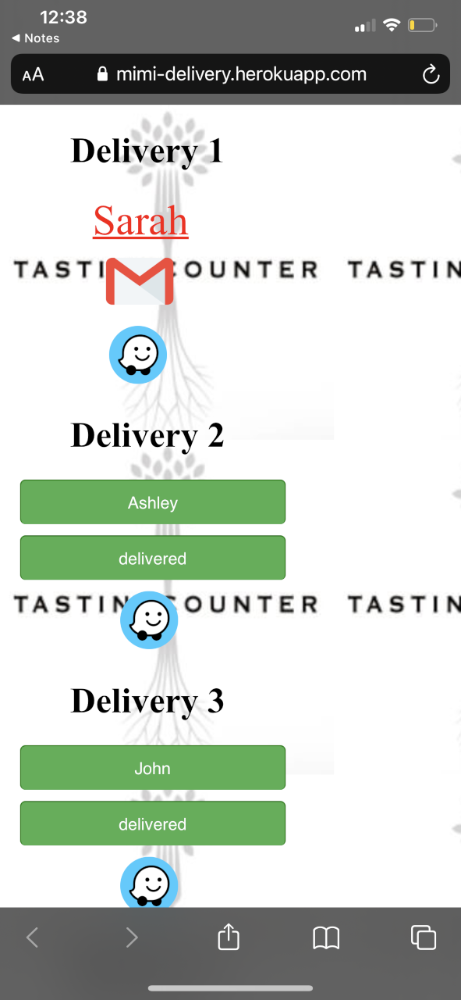
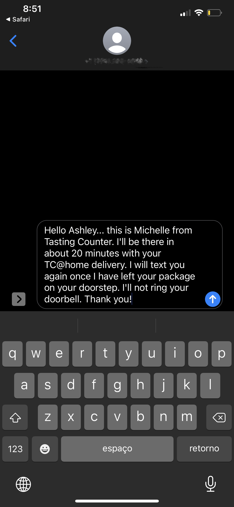
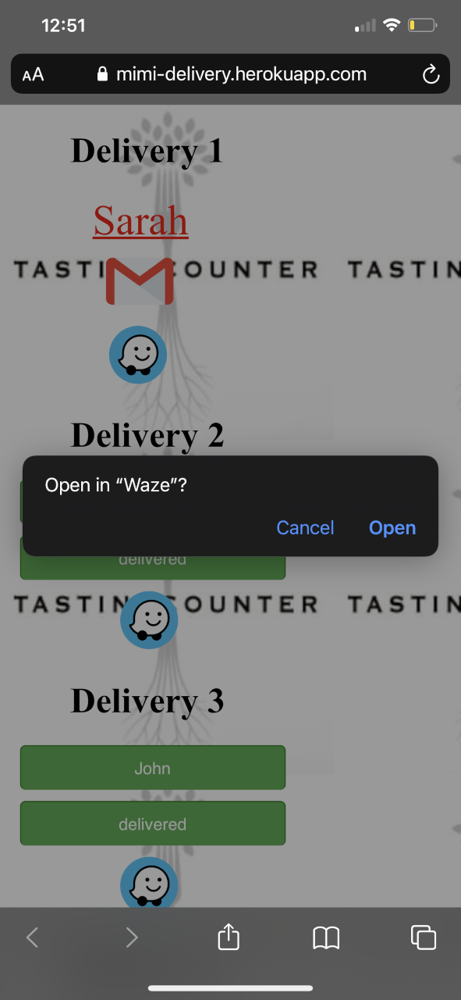
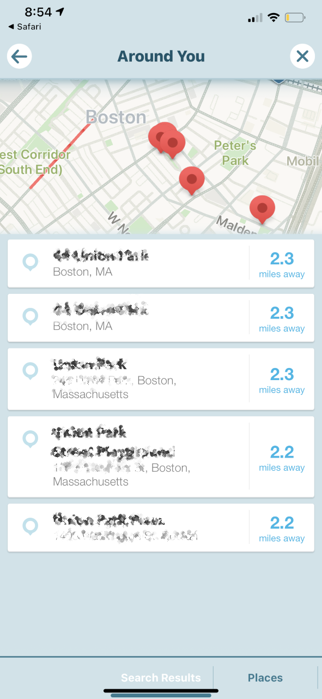
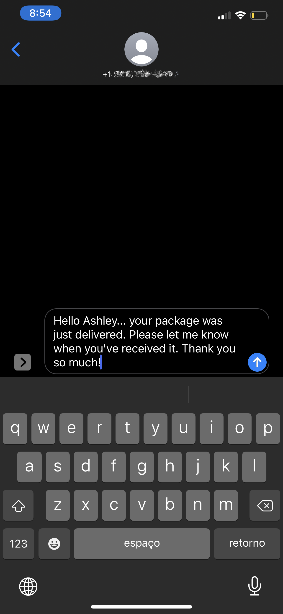

This is the first prototype I created for Tasting Counter delivery so the delivery driver can use while I create a better version.

Everything was being done manually, the driver would receive the deliveries information by text message containing: name, address, phone number, 
and type of delivery(TC Market, or TC@ Home, then he/she would copy and paste into a note application, the for each delivery he/she would copy the address 
and input into the navigation application, then go back to the note and copy the phone number, then go back and copy the template(The template was custom made with the customer name, 
type of delivery and how long it would take for the driver to deliver) for each customer the driver had to change the template. After the deliveries were completed the driver would have to send 
another text to the customer informing him the package was delivered.(He had to go to the note and copy the delivered template custom made with the customer name).

